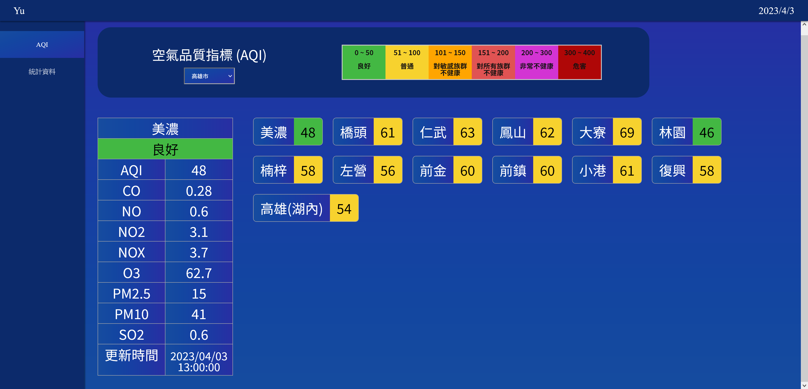
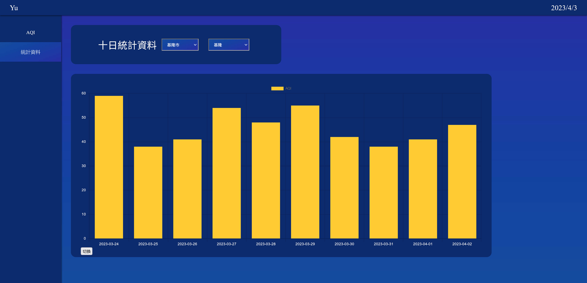
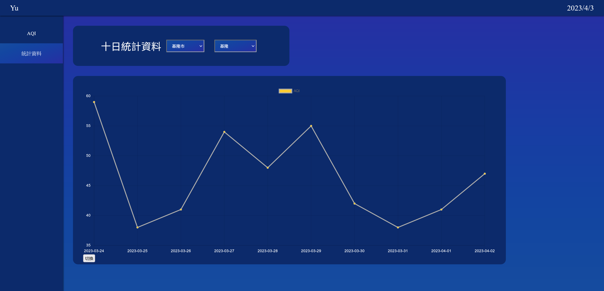

# 簡易AQI儀表
【DEMO :  https://chienyuyu.github.io/yuAQI/#/ 】   
資料來源 : 政府資料開放平台  
空氣品質指標(AQI) : https://data.gov.tw/dataset/40448   
日空氣品質指標(AQI) : https://data.gov.tw/dataset/40507  

 

***

## 使用技術、套件

|  技術/套件   | 簡述  |
| :----- | :----- |
| vite Vue   | 以 Vue3 開發 SPA 網站 |
| VueRouter  | 設定路由 |
| vue-chartjs  | 設定圖表 |
|axios|串接資料|
***